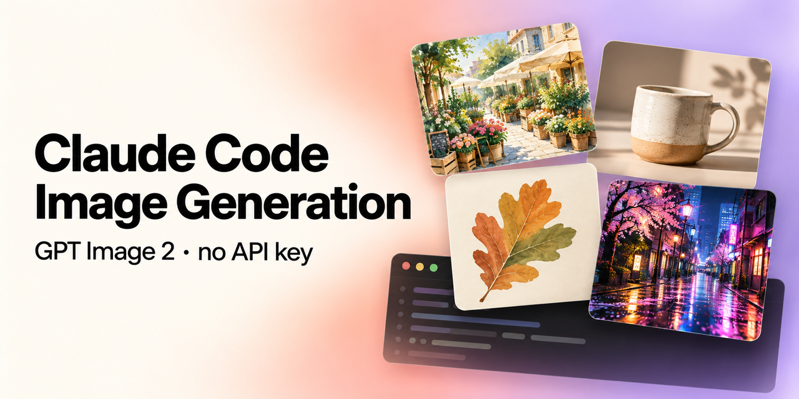
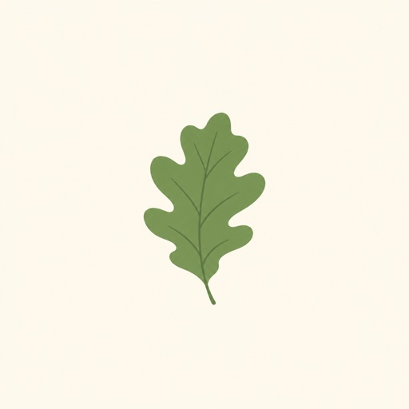
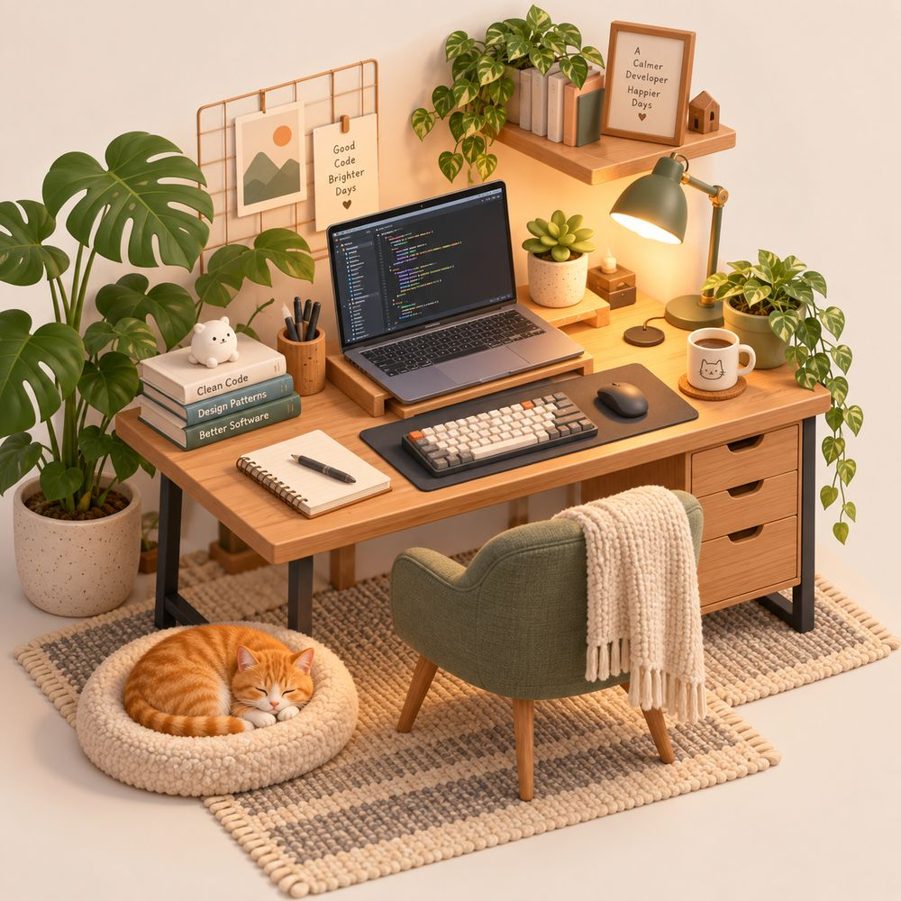
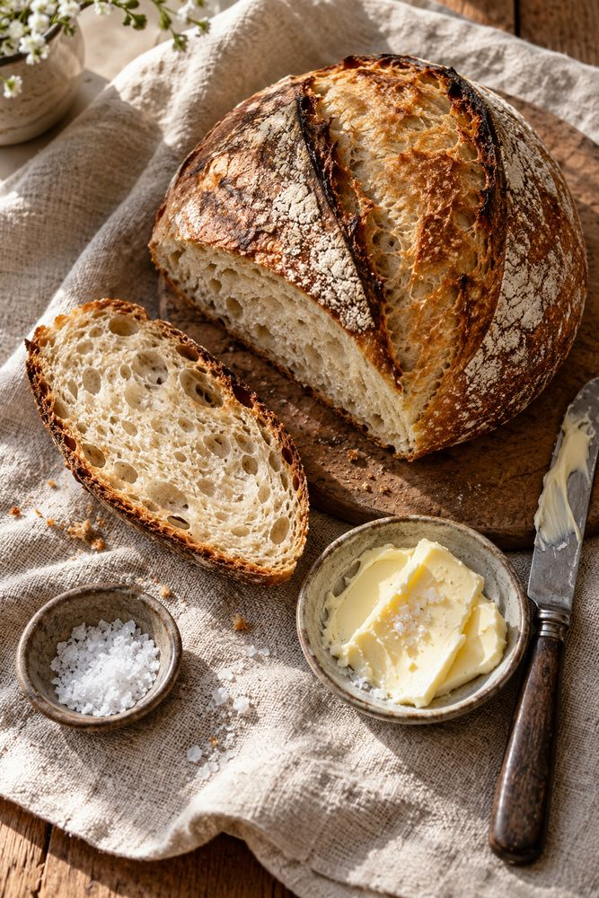

# Claude Code Image Generation with GPT Image 2

[](https://github.com/mishagavura/claude-code-image-generation/stargazers) [](LICENSE) [](https://mishagavura.github.io/claude-code-image-generation/)

**Give Claude Code the ability to generate and edit images.** This free, open-source Claude Code skill connects Claude to
OpenAI's **GPT Image 2** (`gpt-image-2`) through the Codex CLI, using your **ChatGPT subscription**. You don't need an
OpenAI API key or pay-per-image credits.



```bash
curl -fsSL https://raw.githubusercontent.com/mishagavura/claude-code-image-generation/main/install.sh | bash
```

Then ask Claude: *"Generate a hero image for the homepage."* That's it.

---

## Can Claude generate images?

Not on its own. Claude can read images, but it can't create them. This skill adds that: when you ask Claude Code for an
image, it writes a good prompt, runs GPT Image 2 through the Codex CLI, checks the result, and saves the file where your
project needs it.

| Generate | Edit an existing image | Landscape / hero |
|---|---|---|
|  |  |  |
| *"flat illustration of a green oak leaf on a cream background"* | *"make the leaf autumn orange-red, keep everything else"* | *"cozy watercolor of a plant nursery stall at a spring market"* |

More examples, each generated from a one-line prompt (see them all on the [website](https://mishagavura.github.io/claude-code-image-generation/#gallery)):

| | | |
|---|---|---|
|  |  |  |
|  |  |  |

**What you can do:**
- Text-to-image: photos, illustrations, product shots, website hero images, mockups, ad creatives
- Image editing: change colors, lighting or season, remove or replace objects
- Transparent PNGs: stickers, cutouts, icons
- Variants: up to 4 versions of one idea, generated in parallel
- Reference images: match the style or composition of an image you already have

---

## Install (1 minute)

It installs **globally by default**, for every project on your computer. You only do this once.

### Step 1: install the skill

Pick one:

| Method | Command | Installs to |
|---|---|---|
| **One line (recommended)** | `curl -fsSL https://raw.githubusercontent.com/mishagavura/claude-code-image-generation/main/install.sh \| bash` | `~/.claude/skills/` (all projects) |
| **npx** | `npx -y github:mishagavura/claude-code-image-generation` | `~/.claude/skills/` (all projects) |
| **Claude Code plugin** | `/plugin marketplace add mishagavura/claude-code-image-generation` then `/plugin install codex-image@claude-code-image-generation` | your user (all projects); pick "user" scope if asked |
| **Ask Claude** | Paste into Claude Code: *"Install the skill from https://github.com/mishagavura/claude-code-image-generation globally"* | `~/.claude/skills/` |

The installer also offers to install the Codex CLI and sign you in, so steps 2–3 are usually done for you.

<details>
<summary><b>Only want it in one project?</b></summary>

Run the installer from inside that project with `--project`. It goes to `./.claude/skills/`, so you can commit it
and your team gets it too:

```bash
curl -fsSL https://raw.githubusercontent.com/mishagavura/claude-code-image-generation/main/install.sh | bash -s -- --project
```
</details>

### Step 2: Codex CLI (skip if the installer did it)

```bash
npm i -g @openai/codex
```

### Step 3: sign in with ChatGPT (skip if the installer did it)

```bash
codex login     # choose "Sign in with ChatGPT"
```

Restart Claude Code and you're done. Check it's there by typing `/codex-image` in any project.

**Requirements:** [Claude Code](https://claude.com/claude-code), Node.js 18+, a ChatGPT plan that includes image
generation in Codex, and macOS or Linux (on Windows, use WSL).

---

## How to use it

Just ask in plain English:

```
Generate a product photo of a bamboo baby onesie on a light wood table
Make 3 variants of a hero banner for a native plant nursery
Edit hero.png: make it golden hour, keep everything else the same
Create a transparent sticker that says "SALE"
```

Or call the skill directly:

```
/codex-image a neon city street at night, cinematic, 16:9
```

Or run the script yourself, without Claude:

```bash
~/.claude/skills/codex-image/gen.sh -o hero.png -a landscape "watercolor of a spring plant market"
```

| Option | What it does |
|---|---|
| `-o PATH` | Where to save the image (required) |
| `-n N` | 1–4 variants → `hero-1.png`, `hero-2.png`, … |
| `-e FILE` | Edit this image (only what you ask changes) |
| `-r FILE` | Use as a style/composition reference (repeatable) |
| `-t` | Transparent background |
| `-a square\|portrait\|landscape` | Aspect ratio |

Each image takes about 30–90 seconds. Existing files are never overwritten.

---

## How it works

```
You ──▶ Claude Code ──▶ codex-image skill ──▶ codex exec (signed in with ChatGPT)
                                                   │
                                                   ▼
             project/hero.png ◀── copied ◀── GPT Image 2 (built-in image_gen tool)
```

The [Codex CLI](https://github.com/openai/codex) has a built-in image tool powered by GPT Image 2 that runs on your
ChatGPT plan. This skill wraps it in a small script and teaches Claude when and how to call it, then checks each image
before handing it back.

---

## FAQ

### Does Claude have image generation?
Claude can't create images natively. It can analyse them. This skill gives Claude Code image generation by calling
GPT Image 2 through the Codex CLI.

### Do I need an OpenAI API key for GPT Image 2?
No. The skill uses the Codex CLI signed in with your ChatGPT account, so images count against your ChatGPT plan instead
of pay-as-you-go API billing.

### Is GPT Image 2 free with this?
There's no extra cost beyond your ChatGPT subscription, but generations count toward your plan's usage limits. When
you hit the limit, the skill tells you instead of failing silently.

### How do I install skills in Claude Code?
Skills are folders with a `SKILL.md` file in `~/.claude/skills/` (all projects) or `.claude/skills/` (one project).
The installer above puts this one there for you. You can also install it as a Claude Code plugin with `/plugin`.

### Which image model does it use?
GPT Image 2 (`gpt-image-2`), the model behind the Codex CLI's built-in `image_gen` tool.

### Does it work with Claude Desktop or claude.ai?
It's built for Claude Code (terminal, desktop app and IDE extensions), which can run local commands. The web chat
can't run the Codex CLI.

### Why are there blotches on my transparent PNG?
Transparent output (`-t`) sometimes has semi-transparent spots. Generate on a plain white background instead and
remove it with another tool.

---

## Troubleshooting

| Message | Fix |
|---|---|
| `codex CLI not found` | `npm i -g @openai/codex` |
| `Codex is not logged in` | `codex login` → Sign in with ChatGPT |
| `No image was generated` | Plan limit reached or the prompt was refused. Wait, or rephrase. |
| Skill doesn't trigger | Restart Claude Code, or type `/codex-image your prompt` |

**Update:** run the install command again. **Uninstall:** `rm -rf ~/.claude/skills/codex-image`

---

## Contributing

Issues and pull requests are welcome.

**If this saved you an API bill, please [⭐ star the repo](https://github.com/mishagavura/claude-code-image-generation).** It takes one click and helps other Claude Code users find it.

*Not affiliated with OpenAI or Anthropic. This project only drives the official Codex CLI that you install and sign in to
yourself. OpenAI's usage policies apply to generated images.*

MIT © [Mykhailo Gavura](https://github.com/mishagavura) · Built at [EVDEV](https://evdev.dev/?utm_source=github&utm_medium=readme&utm_campaign=claude-code-image-generation), a Shopify & AI development studio.
